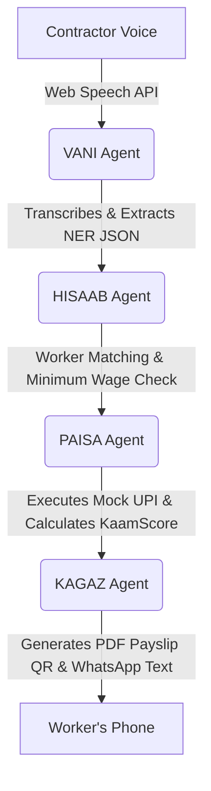

# KaamPay 🇮🇳

> Voice-first AI payroll and credit identity for India's 400M daily wage workers.

KaamPay eliminates exploitation in the unorganized sector by replacing manual, paper-based wage logging with an AI-driven, WhatsApp-delivered digital payroll system. It uses voice recognition, real-time minimum wage compliance checks, and Paytm UPI to distribute wages instantly while building a verifiable "KaamScore" (Credit Identity) for the unbanked.

---

## 📱 Mobile-First Native App Experience
Built with vanilla CSS and smooth micro-animations, optimized for the 390px mobile viewport.

| Point-of-Sale Voice | Real-time AI Pipeline | 1-Click UPI Payment | KaamScore Identity |
| :---: | :---: | :---: | :---: |
|  |  |  |  |

---

## 🎯 The 5-Minute Pitch

1. **Speak to Pay:** Contractors simply say *"Ramesh worked 1 day for ₹700"* into their phone.
2. **AI Processing:** Our Gemini-powered AI extracts the entities, validates against state minimum wages, and prepares the payroll.
3. **Instant UPI:** 1-click execution sends money to any bank account via Paytm UPI.
4. **Digital Proof:** Workers receive an A6, QR-verifiable digital "Kaam Parchi" (Payslip) via WhatsApp or SMS.
5. **Credit Identity:** Every payment builds their **KaamScore**, unlocking micro-loans and insurance.

---

## 🏗️ Architecture (4 Agent System)

KaamPay is powered by a FastAPI Python backend delegating to four specialized AI agents, and a React frontend for the contractor.



### 🧠 The Agents
- **`VANI` (Voice & NLP):** Transcribes Hindi/English voice and extracts structured data (worker names, hours, rates) using Gemini 2.0 Flash.
- **`HISAAB` (Payroll):** Validates parsed data, performs fuzzy-matching against the contractor's worker database, and cross-references state-level Minimum Wage compliance.
- **`PAISA` (Payments):** Simulates Paytm UPI payouts, records transactions in SQLite, and computes the dynamic `KaamScore`.
- **`KAGAZ` (Document Generation):** Generates scannable QR codes, professional A6 PDF payslips, and formatted WhatsApp/SMS payloads.

---

## 🚀 Running the Demo

The KaamPay demo is heavily optimized for a flawless hackathon presentation. It includes a `demo_data.js` offline-fallback that ensures the 5-screen UI flow works perfectly *even if the backend drops*.

### 1. Start the Backend
```bash
cd backend
# Create a .env file: GEMINI_API_KEY=your_key
pip install fastapi uvicorn rapidfuzz reportlab qrcode Pillow google-generativeai
python -m uvicorn main:app --reload --port 8000
```
*Note: If `GEMINI_API_KEY` is missing, VANI falls back to a hardcoded parse matrix to keep the demo alive.*

### 2. Start the Frontend
```bash
cd frontend
npm install
npm run dev
```

Navigate to **http://localhost:5173**. Click **"Play Demo"** to watch the automated 5-screen flow.

---

## 🛡️ Built for Resilience
We know hackathon Wi-Fi is terrible. KaamPay's frontend features an invisible interceptor (`api.js`). If any API call to the backend fails or times out, it instantly serves pre-computed perfect responses. The "continuity over correctness" philosophy ensures judges always see the emotional peak of the demo.

---
*Built with ❤️ for India's invisible workforce.*
